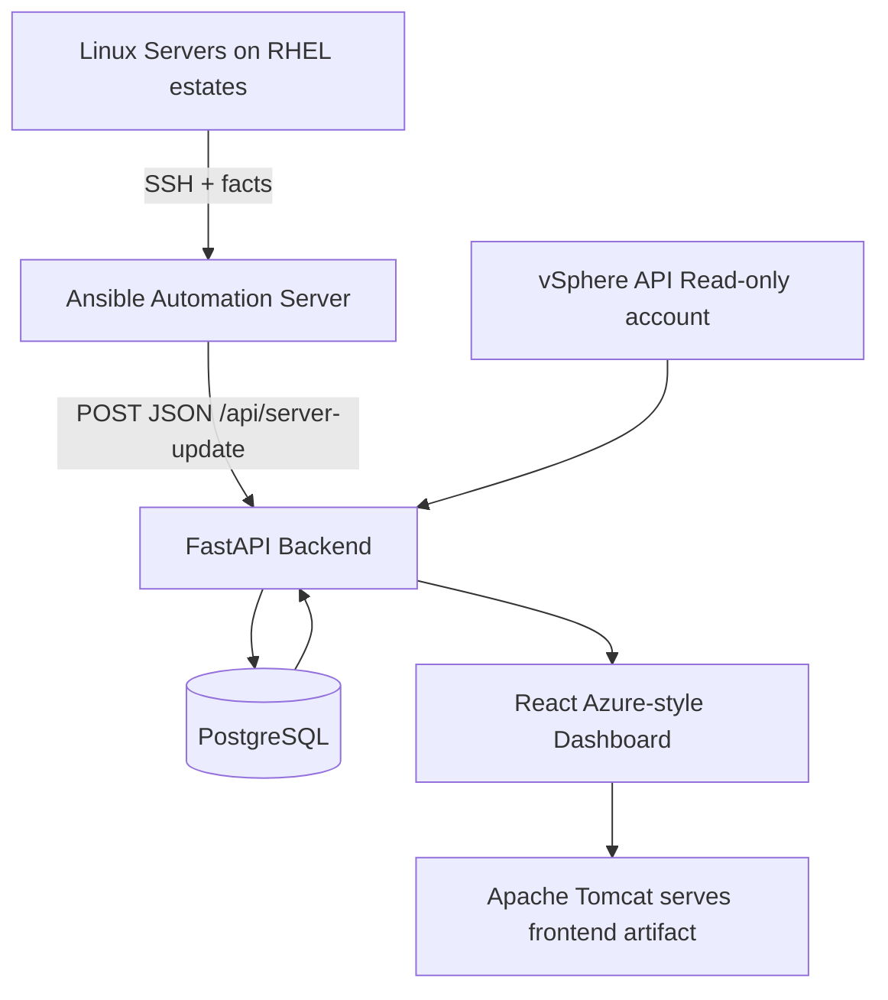

# CBD SERVER INVENTORY

Production-ready internal infrastructure dashboard platform for enterprise networks.

## Open-source stack (commercial safe)
- Backend API: **FastAPI** (MIT)
- Frontend: **React + Tailwind + Framer Motion + Recharts** (MIT)
- Database: **PostgreSQL** (PostgreSQL License)
- Automation: **Ansible** (GPLv3)
- App server: **Apache Tomcat** (Apache-2.0)

## System architecture


## Project structure
```text
backend/
  app/
    api/routes.py
    core/{config.py,security.py}
    db/database.py
    models/{entities.py,schemas.py}
    services/inventory_sync.py
    main.py
  requirements.txt
ansible/
  server_fact_push.yml
frontend/
  public/{manifest.webmanifest,sw.js,offline.html,assets/logo/cbd-logo.svg}
  src/{layout,pages,components,context,data,utils}
docs/schema.sql
scripts/{vsphere_sync.py,ansible_post_patch_sync.sh}
```

## FastAPI endpoints
- `POST /api/server-update`
- `GET /api/servers`
- `GET /api/vm-inventory`
- `GET /api/patch-status`
- `POST /api/sync-inventory`
- `PUT /api/admin/update-server/{server_id}`
- `DELETE /api/admin/server/{server_id}`

## RBAC (IAM-style)
Authorization header uses token role for demo:
- `Bearer admin` -> Admin: read/write/sync/user-management
- `Bearer operator` -> Operator: read/sync
- `Bearer viewer` -> Viewer: read-only

## PostgreSQL schema
See `docs/schema.sql` for tables:
- `servers`
- `patch_history`
- `vm_inventory`
- `clusters`
- `snapshots`

## Ansible integration
Use `ansible/server_fact_push.yml` to collect:
- hostname, IP, OS, kernel, CPU, memory, uptime context
Then push JSON to `POST /api/server-update`.

## Run backend (internal network)
```bash
cd backend
python3 -m venv .venv
source .venv/bin/activate
pip install -r requirements.txt
uvicorn app.main:app --host 0.0.0.0 --port 8000
```

Environment variables (never commit secrets):
- `DB_URL`
- `JWT_SECRET`
- `VSPHERE_HOST`
- `VSPHERE_USERNAME`
- `VSPHERE_PASSWORD`
- `ANSIBLE_FACTS_PATH`

## Build frontend
```bash
cd frontend
npm install
npm run build
```

## Apache Tomcat deployment (no Nginx)
1. Build frontend static assets (`frontend/dist`).
2. Package `dist` as `ROOT.war` (or `cbd-inventory.war`) and deploy to Tomcat `webapps/`.
3. Run FastAPI as systemd service on internal host (`localhost:8000`).
4. In Tomcat, configure reverse proxy servlet/filter or corporate HTTPD->Tomcat connector to route `/api/*` to FastAPI.
5. Keep all traffic internal-only and TLS-terminated per enterprise policy.

## PWA capabilities
- Manifest: installable on mobile/desktop
- Service worker: offline fallback
- Offline page for disconnected usage

## Performance notes
- Indexed server table fields for hostname/IP/cluster/patch status
- Paginated inventory endpoint
- Keep sync jobs asynchronous
- Target: 1000+ servers and 100+ VMs with <3s dashboard load using cached aggregates
